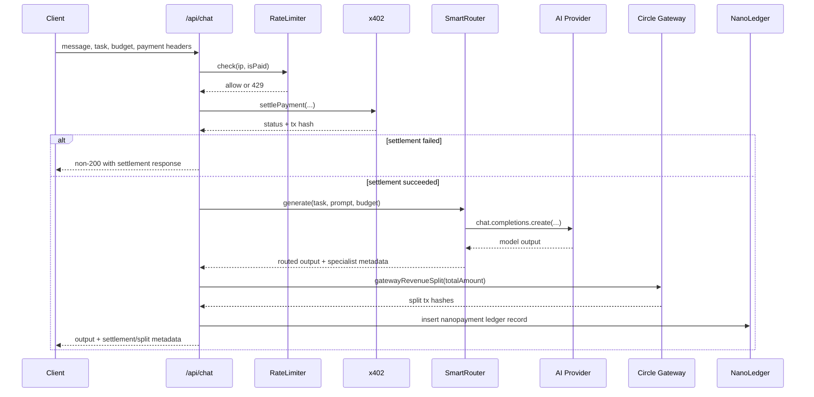

# NanoPay Platform

NanoPay Platform is a payment-gated AI application built with Next.js and TypeScript. It combines x402 micropayment settlement, smart model routing, Circle-based revenue splitting, and Neon/Drizzle ledger logging for observable, usage-based AI requests.

## Table of Contents

- [Overview](#overview)
- [Core Features](#core-features)
- [System Design](#system-design)
- [Trust Boundaries](#trust-boundaries)
- [Threat Model](#threat-model)
- [Architecture Components](#architecture-components)
- [Data Model](#data-model)
- [API Surface](#api-surface)
- [Environment Variables](#environment-variables)
- [Local Development](#local-development)
- [Scripts](#scripts)
- [Operational Notes](#operational-notes)
- [Security Notes](#security-notes)

## Overview

The platform enables users to call AI tasks through a single API while enforcing payment-aware rate limits and generating an auditable payment trail.

Primary task types:

- `chat`
- `summarize`
- `analyze`
- `extract`

The request path supports:

- x402 payment settlement verification
- Dynamic model/provider selection based on task and budget
- Optional revenue splitting to provider, OSS dependency wallet, and platform wallet
- Ledger persistence for dashboard analytics

## Core Features

- **Payment-gated inference** with x402 settlement on Arc-compatible chain settings.
- **Smart routing** between providers/models from task + payment budget.
- **Tiered rate limiting** for unpaid vs paid traffic.
- **Revenue split execution** through Circle transaction APIs.
- **Ledger-backed observability** for payment and transaction history.
- **Agent identity/reputation extension points** via on-chain contract integration.

## System Design

### High-Level Architecture

```mermaid
flowchart LR
	U[Client App / Dashboard] --> N[Next.js App Router]
	N --> C[/api/chat]
	C --> RL[NanoPay Rate Limiter]
	C --> X[x402 settlePayment]
	C --> SR[Smart Router]
	SR --> AI1[AIML Provider]
	SR --> AI2[Featherless Provider]
	C --> GS[Circle Revenue Split]
	C --> DB[(Neon Postgres via Drizzle)]
	N --> D1[/api/dashboard/overview]
	N --> D2[/api/dashboard/transactions]
	D1 --> DB
	D2 --> DB
```

### Request Lifecycle (`POST /api/chat`)



### Rate-Limit Policy

- Public tier: `10 requests / minute`
- Paid tier: `100 requests / minute`

Selection is decided by presence of payment signature headers.

### Routing Policy

Smart routing currently evaluates:

- task category (`chat`, `summarize`, `analyze`, `extract`)
- budget or paid amount (`paidAmountUsdc` preferred)
- premium threshold behavior for higher budget requests
- optional specialist reputation lookup for on-chain IDs

## Trust Boundaries

The platform crosses multiple trust boundaries where data and authority transition between principals.

1. **Boundary A: Client Device -> Platform API**
	- Entry points: browser/dashboard to `POST /api/chat` and other API routes.
	- Trust assumption: client input is untrusted.
	- Controls: input validation, rate limiting, payment requirement checks, no direct key exposure.

2. **Boundary B: Platform API -> x402 / Blockchain Settlement**
	- Entry points: payment settlement verification and transaction metadata retrieval.
	- Trust assumption: only cryptographically valid payment proofs should authorize paid execution.
	- Controls: settlement status enforcement and transaction-hash based traceability.

3. **Boundary C: Platform API -> AI Providers (AIML/Featherless/OpenAI-compatible)**
	- Entry points: model inference requests via provider APIs.
	- Trust assumption: provider responses are untrusted output until sanitized/validated for downstream use.
	- Controls: constrained system prompts, output shaping, and server-side key handling.

4. **Boundary D: Platform API -> Circle Wallet Operations**
	- Entry points: revenue split transaction creation.
	- Trust assumption: payout addresses and transfer amounts must be validated server-side.
	- Controls: deterministic split logic, idempotency keys, environment-scoped secrets.

5. **Boundary E: Platform API -> Database/Redis**
	- Entry points: payment ledger persistence, analytics reads, rate-limit counters.
	- Trust assumption: data store availability and integrity are critical for enforcement and observability.
	- Controls: parameterized ORM operations, explicit failure handling, and minimal secret surface.

6. **Boundary F: CI/Deployment/Admin -> Runtime Secrets**
	- Entry points: environment variable injection and key lifecycle.
	- Trust assumption: deployment actors are privileged and must be tightly controlled.
	- Controls: secret rotation, least privilege, and separation of operational roles.

## Threat Model

### Assets

- Payment authorization and settlement proofs.
- Wallet control credentials and payout configuration.
- AI provider API keys and usage budgets.
- User/account metadata and payment ledger records.
- Service availability for paid and unpaid traffic tiers.

### Adversaries

- Anonymous internet attackers abusing public endpoints.
- Authenticated users attempting payment bypass or replay.
- Prompt-injection attackers trying to exfiltrate secrets or alter behavior.
- Malicious integrators attempting payout redirection.
- Insider or supply-chain actors with partial infrastructure access.

### Priority Threats and Mitigations

1. **Payment bypass / unauthorized premium usage**
	- Risk: high
	- Vector: forged or missing payment metadata with repeated calls.
	- Mitigations: mandatory settlement verification before model execution, paid/unpaid rate tiers, transaction-linked response metadata.

2. **Replay of previously valid payment artifacts**
	- Risk: high
	- Vector: reusing captured signatures/headers to access services repeatedly.
	- Mitigations: bind settlement to request context (resource URL/method/price), track transaction hashes in ledger, enforce replay monitoring rules.

3. **Prompt injection and unsafe model output propagation**
	- Risk: medium-high
	- Vector: hostile user prompts causing policy evasion or harmful downstream instructions.
	- Mitigations: fixed system instructions, conservative response handling, never exposing server secrets to model context.

4. **Payout address tampering / revenue diversion**
	- Risk: high
	- Vector: manipulated provider payout destination or split parameters.
	- Mitigations: server-owned payout configuration, deterministic split ratios (80/10/10), idempotent transaction requests.

5. **Secret leakage (API keys, wallet secrets, private keys)**
	- Risk: critical
	- Vector: source leaks, logs, client-side exposure, CI misconfiguration.
	- Mitigations: environment-only secrets, strict `.gitignore` policy, key rotation procedures, avoid logging sensitive values.

6. **Abuse and denial-of-service against public endpoints**
	- Risk: medium-high
	- Vector: burst traffic, bot floods, or expensive prompt spam.
	- Mitigations: Upstash sliding-window rate limiting, economic gating via x402 settlement, fallback behavior for non-critical paths.

7. **Data integrity loss in ledger and analytics paths**
	- Risk: medium
	- Vector: write failures, partial failures after settlement, inconsistent operational records.
	- Mitigations: explicit error handling around ledger writes, transaction hash retention, operational monitoring for failed inserts.

### Residual Risk

- Third-party dependency compromise remains a systemic risk.
- Blockchain/network outage can degrade payment verification.
- AI provider behavioral drift can reduce output safety without code changes.

Recommended operational controls:

- Continuous dependency and secret scanning.
- Alerting on unusual settlement-to-request ratios and replay-like patterns.
- Periodic tabletop review of wallet compromise and payout redirection scenarios.

## Architecture Components

### Application Layer

- Next.js App Router pages for auth, dashboard, and playground experiences.
- API routes for chat, wallet operations, agent registration, analytics, and transaction history.

### Payment and Settlement Layer

- x402 settlement in the chat route.
- Chain and facilitator config driven by environment variables.
- Transaction hash propagated to response and ledger.

### AI Orchestration Layer

- Central `SmartRouter` picks provider/model based on task + budget.
- Provider fallback behavior available through OpenAI-compatible client abstraction.

### Revenue Distribution Layer

- Circle gateway split strategy:
	- 80% provider payout
	- 10% OSS dependency payout
	- 10% platform payout

### Data and Analytics Layer

- Neon Postgres via Drizzle.
- Ledger table records payment and split metadata.
- Dashboard routes compute or fetch metrics and recent transaction history.

## Data Model

Current core tables:

- `users`
	- identity and wallet linkage fields
- `agent_identities`
	- on-chain agent references and reputation metadata
- `nanopayments`
	- task, settled amount, tx hashes, payout address, status, timestamps

The `nanopayments` table acts as the operational payment ledger.

## API Surface

Main API groups under `src/app/api`:

- `chat`
- `agents/list`, `agents/register`, `agents/reputation`
- `auth/register`
- `dashboard/overview`, `dashboard/transactions`
- `payments/verify`
- `transactions/history`
- `wallets/create`, `wallets/balance`, `wallets/bridge`

## Environment Variables

Copy `.env.local.example` to `.env.local` and fill required values.

```bash
copy .env.local.example .env.local
```

Key groups:

- **Circle**: API key, entity secret, wallet IDs/addresses
- **Blockchain**: Arc RPC URL, chain ID, USDC token contract
- **x402/thirdweb**: facilitator secret and settlement configuration
- **Contract ops**: deployer/server private keys and identity contract address
- **Database**: `DATABASE_URL`
- **Redis**: Upstash URL + token for rate limiting
- **Auth**: NextAuth and JWT secrets
- **AI providers**: AIML/Featherless/OpenAI keys and defaults
- **Specialist routing**: specialist IDs/models/payout wallets

## Local Development

### Prerequisites

- Node.js 18+
- npm 9+

### Install and Run

```bash
npm install
npm run dev
```

Open: `http://localhost:3000`

### Build and Lint

```bash
npm run lint
npm run build
npm run start
```

## Scripts

- `npm run dev`: start development server
- `npm run build`: production build
- `npm run start`: run built app
- `npm run lint`: run ESLint
- `npm run contract:compile`: compile Vyper contract
- `npm run contract:deploy`: deploy identity contract
- `npm run contract:setup`: compile + deploy contract

## Operational Notes

- The chat route writes ledger data after settlement and model execution.
- Revenue split failures currently return a warning while preserving successful AI output.
- Dashboard overview has fallback demo metrics if database access fails.

## Security Notes

- Never commit `.env.local` or any private key values.
- Rotate keys immediately if exposure is suspected.
- Keep wallet signing material server-side only.

## License

Private repository.
